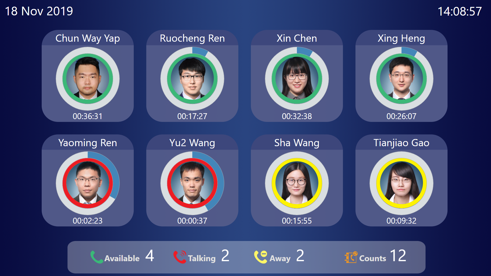

# Phone Support Dashboard X

 Phone Support Dashboard X 专为NISH AE打造，也是由王小荣编写的最后版本。

## 先前版本

### 1. DashboardV2

- 提供了一个基本的显示界面

### 2. DashboardV3

- 提供了基本的程序自动化
- Bug大扫除

## 当前版本

### 目标

1. 给Dashboard添加动画效果
2. 提供一个发布的版本，而非先前的工程版本
3. 面向对象的python

### 待修复的Bug

1. **main.py**无法处理如下情况：当python部分程序在保存 **currentState.txt** 的阶段故障时， **currentState.txt** 会发生损坏。

### **To Do** 清单
